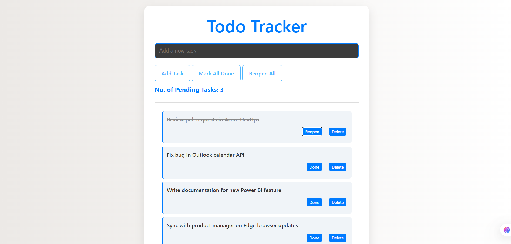

# Todo Tracker

**Todo Tracker** is a simple yet powerful task management application built with **Vite + React**. It helps users organize daily tasks efficiently with features like task creation, editing, deletion, and real-time status updates—all inside a clean and responsive UI.



## 🛠️ Technologies Used

- **React.js** – Frontend UI framework
- **Vite** – Fast build tool for modern React projects
- **JavaScript (ES6+)** – Core programming language
- **CSS3** – Styling and responsive design
- **HTML5** – Markup structure
- **Git & GitHub** – Version control and collaboration

## ✨ Key Features

- **Task Management**: Add, edit, and delete tasks with ease.  
- **Keyboard Shortcut**: Press `Enter` to quickly add a task.  
- **Single Task Expansion**: Open/reopen details for only one task at a time.  
- **Responsive Design**: Works seamlessly across devices.  

## 🚀 Getting Started

To run this project locally:

1. Clone the repository:

    ```bash
    git clone https://github.com/im-h-a-r-s-h/Todo_Tracker.git
    cd Todo_Tracker
    ```

2. Install dependencies:

    ```bash
    npm install
    ```

3. Start the development server:

    ```bash
    npm run dev
    ```

Visit [http://localhost:5173](http://localhost:5173) in your browser to explore Todo Tracker locally.

## 🙏 Acknowledgements
Special thanks to **Shraddha Dii** for her invaluable guidance, encouragement, and insights throughout the development of this project. 
